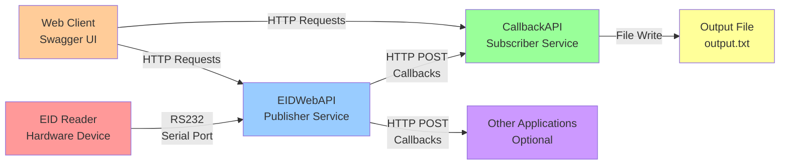
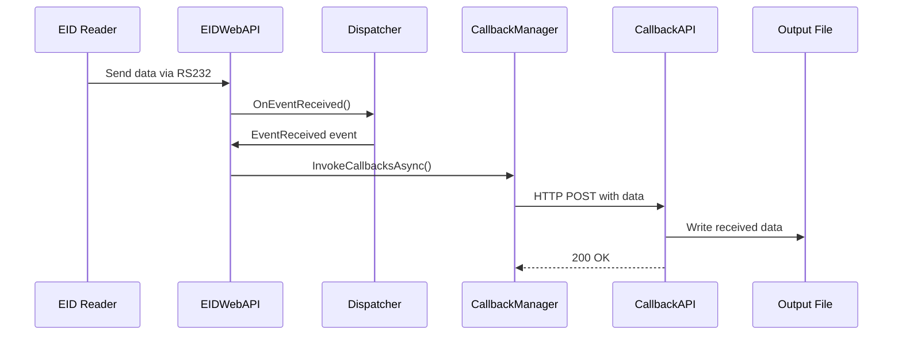

# Architecture Diagram

## Text-Based Architecture Diagram

```
┌─────────────────┐    RS232     ┌─────────────────┐    HTTP     ┌─────────────────┐
│   EID Reader    │◄────────────►│    EIDWebAPI    │◄──────────►│   CallbackAPI   │
│   (Hardware)    │   Serial     │   (Publisher)   │  Callbacks │   (Subscriber)  │
└─────────────────┘    Port      └─────────────────┘    POST     └─────────────────┘
                                                │
                                                │
                                                ▼
                                        ┌─────────────────┐
                                        │   Output File   │
                                        │  (output.txt)   │
                                        └─────────────────┘

┌─────────────────┐
│   Other Apps    │◄─────────────────┐
│   (Optional)    │   HTTP Callbacks │
└─────────────────┘                   │
                                      │
┌─────────────────┐                   │
│   Web Client    │◄──────────────────┘
│   (Swagger UI)  │
└─────────────────┘
```

## Mermaid Diagram (for documentation tools)



## Data Flow Sequence Diagram



## Recommended Diagram Tools

For creating professional architecture diagrams, consider using:

1. **Draw.io (diagrams.net)** - Free web-based tool
2. **Lucidchart** - Professional diagramming tool
3. **PlantUML** - Text-based diagram generation
4. **Mermaid.js** - If you're using Markdown with Mermaid support
5. **Visio** - Microsoft's diagramming tool
6. **PowerPoint** - For quick professional diagrams

## Quick Diagram Template

Here's a simple structure you can follow in any diagramming tool:

```
EID Reader (Hardware)
    ↓ [RS232 Serial Connection]
EIDWebAPI (Port 55555)
    ├── SerialWorker: Reads COM port
    ├── Dispatcher: Manages events
    ├── CallbackManager: Handles registrations
    └── EventController: REST API endpoints
    ↓ [HTTP POST Callbacks]
CallbackAPI (Port 44444)
    ├── Registers with EIDWebAPI
    ├── Receives callback data
    └── Writes to output.txt
    ↓ [File Output]
C:\Tools\output.txt
```

Would you like me to create a more detailed text-based diagram or provide specific instructions for using any of these tools?